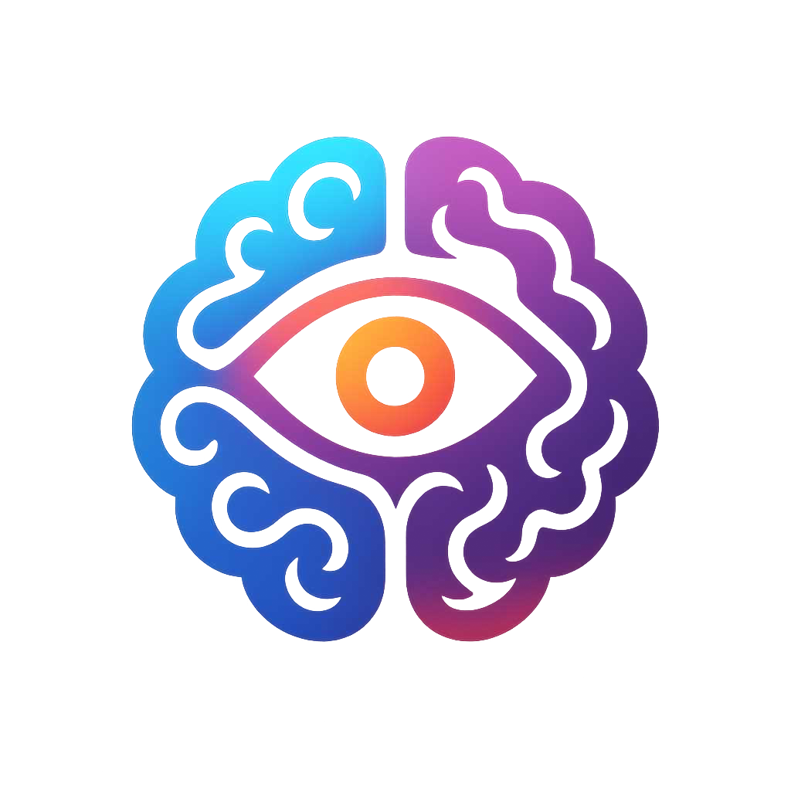

# CEREBRA

<div align="center">
  
  <h1>CEREBRA - Transform Your Memories Into Sci-Fi Masterpieces</h1>
  <p>
    <strong>A revolutionary platform that transforms your ordinary memories into extraordinary sci-fi narratives</strong>
  </p>
</div>

## 🚀 Overview

CEREBRA is a revolutionary platform dedicated to transforming personal memory fragments into unique sci-fi story experiences. Leveraging cutting-edge AI technology, the platform takes user-provided memory fragments as prototypes and reconstructs these everyday experiences into sci-fi narratives, creating personalized immersive stories that are vividly presented through text, images, and videos. CEREBRA is not just a memory preservation tool, but a personal story factory that transforms ordinary moments of life into magnificent sci-fi epics.

### Vision
To transform everyone's memory fragments into unique sci-fi artworks, making ordinary life experiences radiate extraordinary charm, and creating parallel universe stories that belong to each individual through technology.

## ✨ Core Technologies & Features

### 1. Memory Fragment Transmuter
- **Memory Fragment Collection**: Capture specific memory fragments such as photos, journals, oral memories, or significant life events
- **Memory Prototype Analysis**: AI deep analysis of core elements, emotional layers, and character relationships in memory fragments
- **Sci-Fi Element Injection**: Reconstruct daily memories into sci-fi scenes while preserving the original emotional core
- **Personalized Sci-Fi Universe**: Create a unique sci-fi worldview for each user, where all memory stories unfold
- **Multiple Sci-Fi Styles**: Choose from cyberpunk, space exploration, time travel, parallel universes, and more

### 2. Multi-format Sci-Fi Expression System
- **Memory to Visual**: Transform memory fragments directly into high-quality sci-fi style images
- **Sci-Fi Scene Rendering**: Generate sci-fi scenes from user memories, like transforming a family dinner into a reunion aboard a starship
- **Memory Video Conversion**: Create sci-fi short videos based on user memories with appropriate sound effects and atmosphere
- **Scene Connection Narrative**: Cleverly connect multiple memory scenes through sci-fi elements to form coherent storylines

### 3. Personal Memory Sci-Fi Toolkit
- **Memory Protagonist**: Cast users as central characters in their sci-fi stories while maintaining personality traits
- **Relationship Sci-Fi Reshaping**: Transform important people in users' lives into sci-fi characters
- **Scene Alienation**: Transform familiar places into sci-fi environments
- **Memory Linker**: Creatively connect different memory fragments to form complete sci-fi narratives

### 4. Memory-based Sci-Fi Content Hub
- **Multi-format Sci-Fi Stories**: Present complete sci-fi stories through text, image collections, short videos, or interactive narratives
- **Memory Sci-Fi NFTs**: Mint transformed memory sci-fi works as unique NFTs
- **Privacy and Sharing Control**: Precise control over the privacy level and sharing scope of sci-fi memories
- **Sci-Fi Memory Collections**: Create themed sci-fi memory collections

## 🛠️ Technology Stack

- **Frontend**: Next.js 14, React, Tailwind CSS, Framer Motion
- **AI/ML**: Advanced AI models for memory analysis and transformation
- **Blockchain**: Ethereum, Solidity, Web3Modal for NFT integration
- **Storage**: IPFS, Filecoin for decentralized content storage
- **Authentication**: NextAuth.js
- **Testing**: Jest, Vitest, React Testing Library

## 🚀 Getting Started

### Prerequisites

- Node.js 18.x or higher
- npm or yarn
- MetaMask or another Web3 wallet
- Git

### Installation

1. Clone the repository:
   ```bash
   git clone https://github.com/CerebraDEV/Cerebra.git
   cd Cerebra
   ```

2. Install dependencies:
   ```bash
   npm install
   # or
   yarn install
   ```

3. Set up environment variables:
   ```bash
   cp .env.example .env.local
   ```
   Edit `.env.local` with your configuration.

4. Run the development server:
   ```bash
   npm run dev
   # or
   yarn dev
   ```

5. Open [http://localhost:3000](http://localhost:3000) in your browser.

## 📚 Documentation

- [API Documentation](docs/api/README.md)
- [Smart Contracts](contracts/README.md)
- [Development Roadmap](docs/ROADMAP.md)
- [Release Notes](docs/RELEASE.md)

## 📄 License

This project is licensed under the MIT License - see the [LICENSE](LICENSE) file for details.

## 🌐 Community

- [Official Website](https://www.cerebra.work)
- [Twitter](https://x.com/Cerebra_X)
- [GitHub](https://github.com/CerebraDEV/Cerebra)

## 🙏 Acknowledgments

- Ethereum Foundation
- Web3Modal Team
- Next.js Team
- All our contributors and supporters

---

<div align="center">
  <p>Built with ❤️ by the CEREBRA Team</p>
  <p>© 2025 CEREBRA. All rights reserved.</p>
</div> 